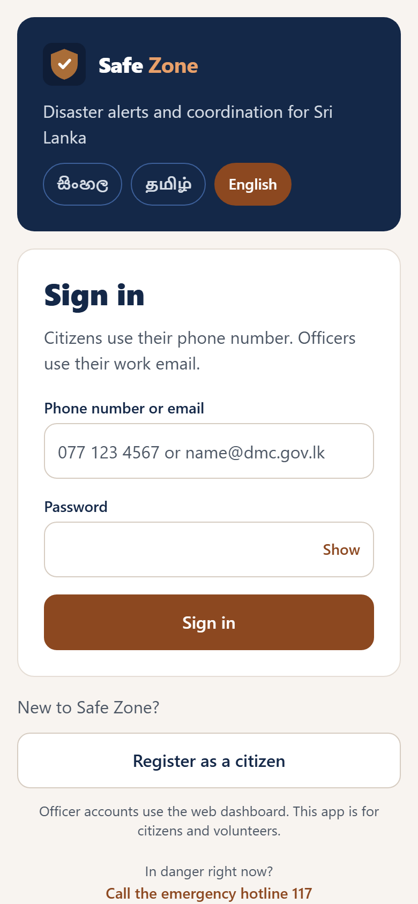
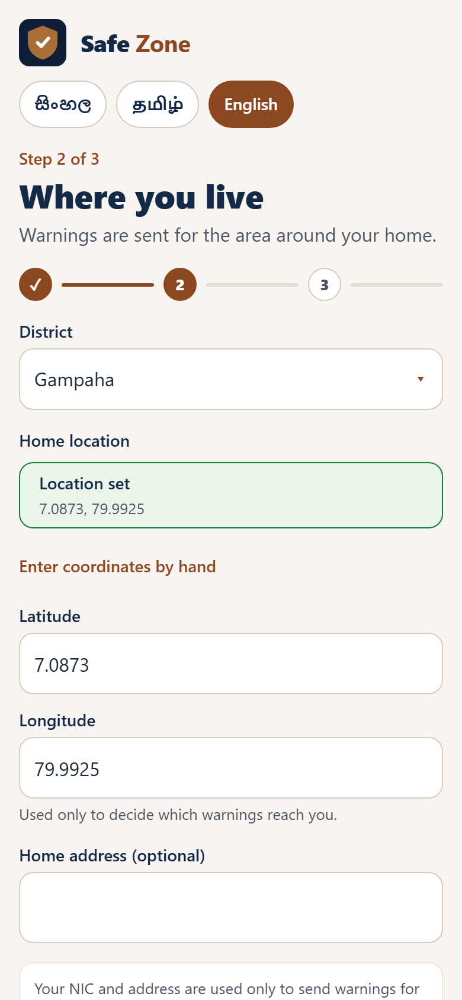
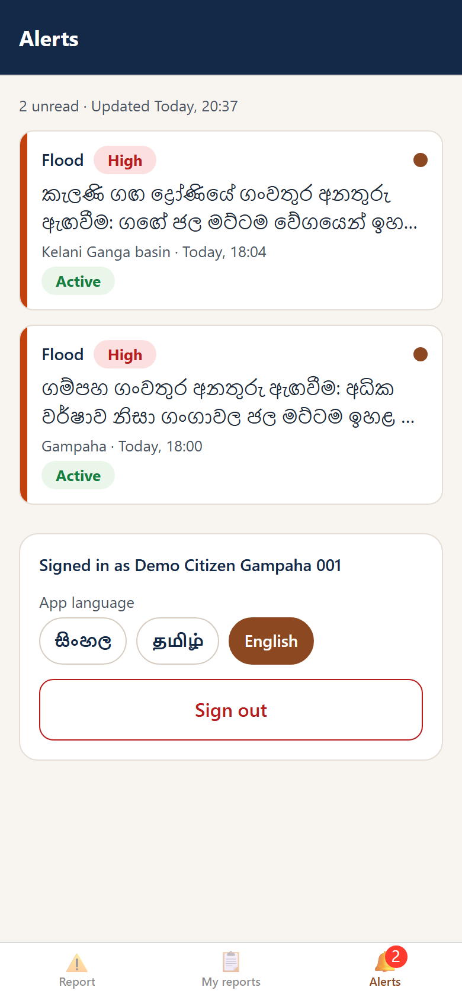
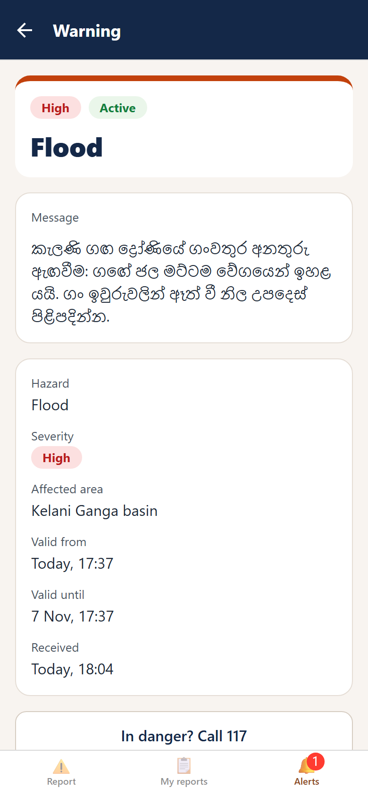
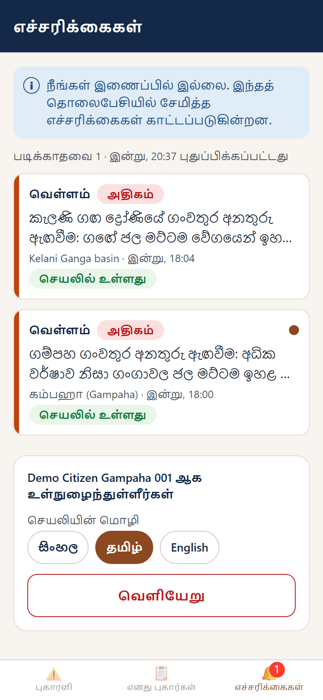

# UC-1 on the phone: the Alerts tab, and sign-in for the mobile app

|              |                                                                                                                                                                         |
| ------------ | ----------------------------------------------------------------------------------------------------------------------------------------------------------------------- |
| **Owner**    | G.V.D. Perera (UC-1 Issue Warning and shared authentication)                                                                                                            |
| **Date**     | 8 October 2026                                                                                                                                                          |
| **Asked by** | the owner: build the mobile (Expo) side of UC-1 from the W9 brief, and sign-in and registration for the mobile app, "taking inspiration from the web app"               |
| **Scope**    | `GET /api/me/alerts` in the API; in `mobile/`: sign-in, registration, the Alerts tab (list and detail), the poll and the banner, plus the small shared pieces they need |
| **Status**   | Built and checked (section 11). Not yet committed. The commit plan is in `reports/commit-plan/UC1-MOBILE-COMMITS.md`.                                                   |

## 1. What was asked

The brief, as it was given:

> **Mobile (Expo), W9.** 6. **Alerts tab**: list of warnings sent to this citizen, severity chip, time, unread dot.
> Pull to refresh; polls `/api/me/alerts` every 15 s while the app is open. 7. **Alert detail**: full message,
> target area, validity period.
>
> How "push" works in the prototype: `PushChannel` succeeds for a citizen with a push token by writing the
> notification into that citizen's inbox (it is just the `AlertNotification` row with status DELIVERED). When the
> app's poll finds a new alert it calls `Notifications.scheduleNotificationAsync` with a null trigger, so the phone
> shows a real banner. Remote push is not used because it does not work in Expo Go. Keep the polling and the
> "which alerts are new" logic in a plain `AlertInboxPoller` class with an injected API client and notifier so it
> can be unit tested without React Native.

And on top of that: "also auth for this mobile app too, take inspiration from the web app".

So the work has four parts: (a) the API the phone polls, (b) the Alerts tab and detail, (c) the poller and the
banner, (d) sign-in and registration on the phone.

## 2. What it looks like

These are the app's web build at phone size (the phone and the browser draw the same screens; only the system bars
differ). Notifications cannot be shown by a browser, so the notification prompt is absent here.

| Sign in                               | Registration, step 2                                                 | Alerts                                           |
| ------------------------------------- | -------------------------------------------------------------------- | ------------------------------------------------ |
|  |  |  |

| One warning in full                                  | Tamil, offline, saved list still shown                       |
| ---------------------------------------------------- | ------------------------------------------------------------ |
|  |  |

What each shows:

- **Sign in**: the web's navy header with the logo, the three language pills, "Phone number or email" and password,
  "Register as a citizen", and the emergency hotline (117) one tap away.
- **Registration**: the web's three steps with the same fields and the same rules. Step 2 has a district list, a "use
  my current location" button (or typed coordinates) and an optional address.
- **Alerts**: newest first. Each row has a coloured bar, the hazard, a **severity chip with words** (never colour
  alone), a line of the message, where and when, an **Active / Expired / Starts…** chip, and an **unread dot**. The
  tab shows how many are unread. A line says when the list was last fetched.
- **A warning in full**: the whole message, hazard, severity, affected area, valid from and until, and when it
  reached the citizen. Opening it marks it read.
- **Tamil and offline**: the app's own texts follow the app language; the message stays in the language the citizen
  asked warnings in. With no connection the saved list stays on screen and a line says so.

## 3. How a warning reaches a phone

```
DMC Officer: Approve & Issue
   │  (existing UC-1 flow, unchanged)
   ▼
AlertDeliveryManager sends on each channel ──► one AlertNotification per citizen
                                                 attempts: PUSH, SMS …   overallStatus: DELIVERED
   ▼                                                                                   │
Warning becomes ISSUED                                                                 │
                                                                                       ▼
Citizen's phone: AlertInboxPoller, every 15 s while the app is open ──► GET /api/me/alerts
   │   (their DELIVERED rows, joined with the ISSUED warning, newest first)
   ▼
new alert? ──► a local notification (the banner)  +  the Alerts list, with an unread dot
```

There is no separate inbox table. A citizen's inbox **is** their `AlertNotification` rows that were delivered,
joined with the warning they are about, which is exactly what the brief says the simulated push channel "writes". So
the officer's delivery summary and the citizen's phone cannot disagree.

## 4. The API: `GET /api/me/alerts`

| Rule             | What the server does                                                                                                                                                                                                         |
| ---------------- | ---------------------------------------------------------------------------------------------------------------------------------------------------------------------------------------------------------------------------- |
| Who may ask      | A signed-in `CITIZEN` or `COMMUNITY_VOLUNTEER`. Anyone else: 401 `UNAUTHENTICATED` or 403 `FORBIDDEN_ROLE`. Staff accounts have no phone to alert.                                                                           |
| Whose alerts     | The caller's own, from the signed-in identity. There is no id in the request to guess or change.                                                                                                                             |
| Which alerts     | Rows with `overallStatus` DELIVERED (at least one channel got through, so a citizen reached only by SMS also sees it) of a warning that is `ISSUED`.                                                                         |
| Order and size   | Newest first by when it first got through (`deliveredAt`); at most 100.                                                                                                                                                      |
| What comes back  | `{ alerts: [...], serverTime }`; each alert has `alertId`, `warningId`, `hazardType`, `severity`, `message` (the text this citizen was sent, in their language), `language`, `areas`, `validFrom`, `validTo`, `deliveredAt`. |
| What never comes | Other citizens, channels, attempts, error codes, officers' ids, boundaries of areas.                                                                                                                                         |
| `serverTime`     | So the phone decides "still valid" by the server's clock, not its own (a phone with the wrong time must not call an expired warning active).                                                                                 |
| Caching          | `Cache-Control: no-store`: personal data that changes every few seconds.                                                                                                                                                     |
| Speed            | A new index `{ citizenId, overallStatus, createdAt }`, because the phone asks every 15 seconds.                                                                                                                              |

In the code: `AlertNotification.deliveredAt()` (domain), `CitizenAlertInbox` (application), two repository methods
(`findDeliveredByCitizen`, `findByIds`), `api/myAlerts.http.ts` and `api/myAlerts.dto.ts`.

## 5. The phone app

```
mobile/src/
├─ app/                        routes only: _layout (the gate), index, sign-in, register, (tabs)/…, (tabs)/alerts/{index,[id]}
├─ shared/
│  ├─ api/                     apiClient (cookies, CSRF header, refresh once), errors
│  ├─ session/                 SessionController (plain TS), SessionStore, SessionProvider
│  ├─ contracts/               the API's enums and identity rules, copied (section 9, D7)
│  ├─ i18n/                    Sinhala / Tamil / English texts, translate, date and place formatting
│  ├─ storage/  theme/  ui/    the one AsyncStorage adapter, the web's colours, shared components
└─ features/
   ├─ auth/                    domain (form rules, steps, submit), hooks, components, screens, adapters (location, device marker)
   └─ alerts/
      ├─ domain/               types, parseInbox, validity, notificationText, AlertInboxPoller + ports      ← no React, no Expo
      ├─ api/                  HttpAlertsGateway                                                          ← no React, no Expo
      ├─ storage/              KeyValueInboxStorage (one citizen's inbox on the phone)
      ├─ adapters/             ExpoNotifier (the one file that uses expo-notifications), timing
      ├─ hooks/  components/  screens/   AlertInboxProvider, rows and chips, the two screens
```

The plan for the mobile app (UC-3 plan, Phase M0) asks for exactly this split: `domain/` and `api/` import nothing from
React, React Native or Expo; time and ids come in through ports; each Expo API sits in one adapter file. A lint rule
now enforces it (section 10).

### 5.1 `AlertInboxPoller`: how "new" is decided

It is a plain class. Its dependencies (the API gateway, the notifier, storage, a clock, a timer) are passed in, so its
tests run without React Native, with a timer the test drives by hand.

| Rule                                                 | Why                                                                                                                         |
| ---------------------------------------------------- | --------------------------------------------------------------------------------------------------------------------------- |
| Polls at once, then every 15 s; never two at once    | A fetch already under way is joined, so pull-to-refresh during a poll does not double the request.                          |
| An alert is **new** when its id was never announced  | Ids, not timestamps: a late delivery or a wrong phone clock cannot hide or repeat a warning. Remembered per citizen.        |
| New and still valid: a banner                        | At most 3 per poll, oldest first so the newest ends on top. The rest are marked as told, without a banner.                  |
| New but already expired: no banner                   | It stays in the list; it never buzzes later. A new phone does not get a burst of old warnings.                              |
| A banner that cannot be shown does not stop the rest | No permission, or the system refused: the alert is still in the list with its unread dot.                                   |
| An alert is **unread** until its detail was opened   | The count on the tab is the number of unread alerts in the list.                                                            |
| "Valid" is judged by the server's time               | `serverTime` minus the phone's clock at that moment is kept as a skew and applied.                                          |
| Offline or an error: keep the list, say why          | `OFFLINE`, `SERVER`, or `SESSION_EXPIRED` (which sends the person back to sign in). The next good fetch clears the notice.  |
| What survives closing the app                        | The list, the clock skew, the last fetch time, and the announced and read ids (500 each), under `safezone.alerts.<userId>`. |

The provider polls while the app is not in the background, and stops by itself on sign-out (the signed-in tabs
unmount).

### 5.2 The banner

`ExpoNotifier` is the only file that touches `expo-notifications`. A banner is a local notification scheduled for now.
On iOS that is the `null` trigger of the brief. On Android the trigger names the `warnings` channel (importance max,
vibration, shown on the lock screen), because a plain `null` trigger lands in a quiet default channel. The
notification's identifier is the alert's id, so announcing the same alert twice replaces the banner instead of
stacking two. A handler is switched on at start-up: without one the phone drops a notification that arrives while the
app is open, which is exactly when the poll finds new alerts. The title and text are written in the **alert's**
language (the one the citizen asked warnings in), whatever language the app is showing. Tapping a banner opens that
alert, including when the tap started the app from closed.

Permission is asked at the moment it matters, in one line on the Alerts tab, and the app points to the phone's
settings when notifications were refused for good.

## 6. Sign-in and registration on the phone

**Same rules as the web.** The sign-in screen takes a phone number or email and a password (the API takes no other
identifier). Registration is the web's three steps with the same fields and error texts. The checks run before the
request, with the same rules the server applies; a test (`contracts.parity.test.ts`) runs the phone's copy and the
API's own schema on the same inputs (every kind of NIC, phone, password, e-mail and whole form the screen can
produce) and fails if they ever disagree. It already caught two disagreements while this was written (names and
addresses are counted in characters, not in UTF-16 units). The server stays the authority: its
field errors, a phone number already registered, or "your pin looks closer to Colombo" (the district question) are
shown on the right field or as the same two-button question the web asks.

**How the session works.** The server's session lives in two httpOnly cookies and `requireAuth` reads only the access
cookie. The phone's network stack keeps cookies like a browser does, so the app never sees or stores a token:

- every request sends the `X-Requested-With: SafeZone` header the API requires on anything that changes data;
- a 401 `UNAUTHENTICATED` or `TOKEN_EXPIRED` triggers one `POST /api/auth/refresh` shared by every request that
  expired together, then the request is repeated once; if the refresh fails, the person goes back to sign-in;
- the app keeps a small cache of who is signed in (id, role, name; never a password, token or NIC) so it opens
  instantly and offline already knowing whose phone it is; only a 401 ends that, never a network error;
- **only citizens and volunteers sign in on a phone.** If an officer signs in, the app logs that session straight out
  of the server again and says "Officer accounts use the web dashboard";
- sign-out asks first, because a phone that is signed out stops receiving warnings.

**The push marker.** UC-1 chooses Push for a citizen who has a `deviceToken`. Remote push cannot work in Expo Go, so the
app sends a random per-install id as the `deviceToken` at registration. It is a marker ("this citizen has the app"),
not a push address; delivery to the app is the inbox plus the poll.

## 7. Languages

There are two, on purpose. The **app's texts** (buttons, labels, errors) follow the language chosen on the sign-in
screen or at the bottom of the Alerts tab, and are remembered. The **warning's text** arrives in the language the
citizen asked for at registration; the two can differ (the Tamil screenshot shows a Sinhala warning). Most of the
wording is the web app's own (140 of 201 texts), so a screen reads the same on both; the 61 that exist only on the
phone are new in all three languages. Dates and times are written by hand ("Today, 14:30", "8 Oct, 14:30") because a
phone's own formatting may lack Sinhala or Tamil data.

## 8. What was left out, and why

| Left out                                      | Reason                                                                                                |
| --------------------------------------------- | ----------------------------------------------------------------------------------------------------- |
| Remote push                                   | It does not work in Expo Go (the brief says so). The poll and local notifications do.                 |
| Alerts while the app is closed                | The brief says "while the app is open". A background task could be added later; it was not asked for. |
| "Forgot password"                             | The API has no such feature (same as the web).                                                        |
| Pages beyond the latest 100                   | An inbox is a short list; the server caps it so the 15-second poll stays small.                       |
| Editing profile or device token after sign-up | No API for it. A citizen who registered on the web has no marker (see section 12).                    |

## 9. Decisions, and why

| #   | Decision                                                                                                                   | Why                                                                                                                                                                                                |
| --- | -------------------------------------------------------------------------------------------------------------------------- | -------------------------------------------------------------------------------------------------------------------------------------------------------------------------------------------------- |
| D1  | The inbox is the citizen's delivered `AlertNotification` rows joined with the issued warning.                              | It is what the brief calls the inbox. One source of truth for the officer's summary and the phone. No second table to keep in step.                                                                |
| D2  | `/api/me/alerts` is mounted as a **second module registration** (`createCitizenAlertsModule`, one line in `bootstrap.ts`). | The foundation says new routes plug in through a registration and `app.ts` stays untouched. The officer routes are guarded for DMC Officers as a whole, so `/api/warnings/mine` was not an option. |
| D3  | A cookie session, like the web. No token in the app.                                                                       | `requireAuth` reads only the cookie; the plan (Phase M0, D §8) relies on the platform cookie jar so a background run is signed in too. Nothing secret is ever in app storage.                      |
| D4  | Refresh once, shared, on 401.                                                                                              | Several requests expire together (a poll and a tap); one refresh keeps the rotating refresh token from being used twice.                                                                           |
| D5  | A banner only for new alerts that are still valid, at most three per poll.                                                 | A warning that already ended must not wake a phone; a new phone must not buzz twenty times.                                                                                                        |
| D6  | "Valid" and "Today" use the server's clock.                                                                                | Phones are often wrong by minutes or hours.                                                                                                                                                        |
| D7  | The phone **copies** the API's enums and identity rules, and a test compares the copies to the originals.                  | The mobile app is not one of the npm workspaces, so it cannot import `backend/src/shared/contracts`. Copying with a parity test is cheap and catches drift on the day it happens.                  |
| D8  | Alerts and read marks are stored per signed-in citizen (`safezone.alerts.<userId>`).                                       | Two people can use one phone without seeing each other's warnings or read marks.                                                                                                                   |
| D9  | The Android banner names the `warnings` channel.                                                                           | A `null` trigger on Android lands in a default channel that may not pop up. The brief's behaviour (immediate banner) is kept.                                                                      |
| D10 | Polling stops only in the background, not on "inactive" or "unknown".                                                      | Right after launch the state can read "unknown"; a citizen must not lose alerts to that.                                                                                                           |
| D11 | The mobile lint rules of the UC-3 plan (Phase M0.2) were added to `eslint.config.mjs`.                                     | CI lints the whole repo, so mobile code was already being checked, with the backend's 40-line limit. The plan's block allows 90 lines for screens (as the web does) and enforces the pure core.    |

## 10. Files outside UC-1 that were touched (say so in the pull request)

| File                                                            | Change                                                                                                                                                                                                                                                                                   |
| --------------------------------------------------------------- | ---------------------------------------------------------------------------------------------------------------------------------------------------------------------------------------------------------------------------------------------------------------------------------------- |
| `backend/src/bootstrap.ts`                                      | One import and one line: the new module registration (the documented way to add one).                                                                                                                                                                                                    |
| `backend/src/__tests__/bootstrap.integration.test.ts`           | "Registers every use-case module": 4 becomes 5, and `/api/me` is checked like the others.                                                                                                                                                                                                |
| `eslint.config.mjs`                                             | Mobile block from the UC-3 plan: React hooks rules, 90 lines per function, and no React or Expo in `domain/`, `offline/`, `api/`. Also ignores `mobile/android`, `ios`, `.expo`, `dist`.                                                                                                 |
| `.prettierignore`                                               | The same generated mobile folders.                                                                                                                                                                                                                                                       |
| `mobile/jest.config.js`                                         | Coverage list extended to the new plain-TypeScript folders; Sri Lanka time zone for the tests; a longer timeout for the first, cold test of each file.                                                                                                                                   |
| `mobile/src/app/_layout.tsx`, `index.tsx`, `(tabs)/_layout.tsx` | The shell's sign-in gate and splash, the redirect, tab titles in three languages, the unread badge, tab icons. `(tabs)/alerts.tsx` and the placeholder `features/alerts/AlertsScreen.tsx` are replaced.                                                                                  |
| `mobile/src/shared/config.ts`, `mobile/.env.example`            | While developing, the API is found from where the app was loaded (the laptop's Wi-Fi address for Expo Go, `localhost` in a browser, port 4000) instead of a fixed address that went stale on another network; `EXPO_PUBLIC_API_URL` still wins, and the example now says it is optional. |
| `mobile/assets/images/brand-mark.png`                           | The web's logo, as an image.                                                                                                                                                                                                                                                             |

The UC-3 owner builds the hazard screens on this shell. Nothing of theirs was changed except the three shell files
above and their tab titles; the Report and My reports tabs now show a title in the app's language and an icon.

## 11. How it was checked

| Check                                                                                                         | Result                                                                                                                                                                                                                                                                                                                                                                                                                                                                                                                                                                                                                                                                                                                                                                                                                                                                                                                                                                                                                             |
| ------------------------------------------------------------------------------------------------------------- | ---------------------------------------------------------------------------------------------------------------------------------------------------------------------------------------------------------------------------------------------------------------------------------------------------------------------------------------------------------------------------------------------------------------------------------------------------------------------------------------------------------------------------------------------------------------------------------------------------------------------------------------------------------------------------------------------------------------------------------------------------------------------------------------------------------------------------------------------------------------------------------------------------------------------------------------------------------------------------------------------------------------------------------- |
| API tests for the new code (domain, application, repositories, HTTP, DTO, end to end through the real wiring) | All pass; `modules/warnings` stays at 100% of statements, branches, functions and lines.                                                                                                                                                                                                                                                                                                                                                                                                                                                                                                                                                                                                                                                                                                                                                                                                                                                                                                                                           |
| Whole backend suite                                                                                           | 1,103 of 1,111 tests pass (56 of 58 suites). The 8 that fail are the ones already red on `develop` from the UC-4 merge (7 argon2 tests under the `Node16` tsconfig, and the analytics seed that expects 12 events and gets 60, which also trips the analytics 100% gate). None is in UC-1 or in this work.                                                                                                                                                                                                                                                                                                                                                                                                                                                                                                                                                                                                                                                                                                                         |
| Mutation testing of the new domain and application code (Stryker)                                             | `CitizenAlertInbox.ts` 100% (9 killed, 0 survived). `AlertNotification.ts` 100% (62 killed, 3 timeouts, 0 survived).                                                                                                                                                                                                                                                                                                                                                                                                                                                                                                                                                                                                                                                                                                                                                                                                                                                                                                               |
| Phone tests (Jest, jest-expo, React Native Testing Library)                                                   | 502 tests in 21 files, all pass: the poller with a hand-driven timer, the parser and the clock rules, the gateway and storage, the API client (refresh, CSRF, timeouts), where the API is found, the session, the form rules against the API's own schema, sign-in and registration screens, the Alerts and detail screens, the provider (background and foreground), the notification adapter's exact calls, and the whole app's route gate over a pretend server.                                                                                                                                                                                                                                                                                                                                                                                                                                                                                                                                                                |
| Coverage of the plain TypeScript (`domain`, `api`, `storage`, `shared/*`)                                     | 99.8% of statements, 99.7% of branches, 100% of functions and lines, over the gates of 90, 85, 90 and 90.                                                                                                                                                                                                                                                                                                                                                                                                                                                                                                                                                                                                                                                                                                                                                                                                                                                                                                                          |
| ESLint (root config incl. mobile rules), Prettier, `tsc --noEmit`                                             | Clean.                                                                                                                                                                                                                                                                                                                                                                                                                                                                                                                                                                                                                                                                                                                                                                                                                                                                                                                                                                                                                             |
| `npx expo-doctor`                                                                                             | 21 of 21 checks pass.                                                                                                                                                                                                                                                                                                                                                                                                                                                                                                                                                                                                                                                                                                                                                                                                                                                                                                                                                                                                              |
| `npx expo export --platform android`                                                                          | Bundles (a 3 MB Hermes bundle).                                                                                                                                                                                                                                                                                                                                                                                                                                                                                                                                                                                                                                                                                                                                                                                                                                                                                                                                                                                                    |
| Whole-app end-to-end suite (Playwright: the web app against the real API, with the new route mounted)         | 41 passed, 1 skipped (the screenshots spec, which runs only on request).                                                                                                                                                                                                                                                                                                                                                                                                                                                                                                                                                                                                                                                                                                                                                                                                                                                                                                                                                           |
| Where the app finds the API (`src/shared/config.ts`), in the web build and from the development server        | With nothing set, a browser at `localhost` sent sign-in to `http://localhost:4000`; a request to the development server through the laptop's Wi-Fi address was told `hostUri` is that address (so Expo Go on a phone resolves to it); `EXPO_PUBLIC_API_URL`, when set, wins and loses its trailing slash. The requests were stopped inside the browser, so no server was called.                                                                                                                                                                                                                                                                                                                                                                                                                                                                                                                                                                                                                                                   |
| Live, in a browser against a scratch API and database                                                         | Signed out you reach only sign-in and register; a seeded citizen signs in; an officer issues a warning and it appears on the citizen's Alerts tab on the next 15-second poll with the unread dot and a tab badge; opening it clears the dot; a new citizen registers (the marker is stored on their profile) and is signed in; stopping the API shows the offline notice with the saved list, and starting it again clears the notice by itself; Sinhala and Tamil switch every text. With the access cookie removed by hand, the next poll got a 401, the app made one `POST /api/auth/refresh` (200) and repeated the request (200) with the person still signed in; with both cookies removed the refresh answered 401 and the app returned to sign-in with "Your session ended". Left alone on the Alerts tab for 17 minutes (longer than the 15-minute access cookie), the app made 69 successful polls; at the 15-minute mark one poll got a 401, one refresh (200) followed, and polling carried on, never showing sign-in. |

Not checked, because no phone was available here: real notification banners (the calls to `expo-notifications` are
pinned by tests, and the poll that triggers them was seen working), the system permission prompt, GPS, and iOS.

## 12. Open items and limits

1. **Try it on a phone** (section 13) before the viva: the banner, the permission prompt and the location button are the
   parts only a device can show.
2. **The marker is not a push token.** A citizen who registered on the web has no `deviceToken`, so Push is not among
   their channels; SMS still reaches them and the alert still appears in the app, because the inbox is every delivered
   alert. A way to attach a phone to an existing account would be a new API, which was not asked for.
3. **The 61 texts that exist only on the phone** (Alerts, account, notification) are drafts in Sinhala and Tamil, like
   the web's. Have a native speaker read them.
4. **A citizen who registers after a warning was issued does not get it.** Alerts are created for the citizens in the
   area when the warning is issued (UC-1 step 9); nothing is back-filled.
5. **Signing out with no connection** clears the phone but cannot end the session on the server; it runs out by itself.
6. **`npx expo lint`** was not run: `mobile/` has no ESLint setup of its own, and the root ESLint (which CI runs) covers it.
7. The tab icons are emoji, because no icon library is installed and none was added.
8. `HazardType` and `Severity` are still the provisional shared enums; the phone mirrors them and the parity test will
   flag a change.

## 13. Run it on a phone

1. Seed and start the API (the demo citizens are phones `0771500001` to `0771500200`; the password is the demo password
   in the README):

   ```bash
   npm run seed
   npm run dev -w backend
   ```

2. Nothing to type: while developing, the app finds the API by itself. It uses the machine it was loaded from, on port
   4000 (`src/shared/config.ts`): the laptop's address on the Wi-Fi when Expo Go runs on a phone, `localhost` in a
   browser. A fixed address in a file goes stale whenever the laptop joins another network, and then sign-in hangs until
   it times out. Allow Node through the Windows firewall for private networks when it asks; the phone and the laptop
   must be on the same network. Set `EXPO_PUBLIC_API_URL` in `mobile/.env.local` (see `.env.example`) only when the API
   is elsewhere, for example behind a tunnel, and restart Metro with `npx expo start -c` after changing it.

3. Start the app (from `mobile/`): `npm run start` for a development build, or `npx expo start --go` for Expo Go.
   Local notifications work in both; remote push would not, and is not used.

4. Try this:

   | Do this                                                                                      | You should see                                                                            |
   | -------------------------------------------------------------------------------------------- | ----------------------------------------------------------------------------------------- |
   | Sign in as `0771500001`, open the Alerts tab, tap **Turn on notifications**                  | An empty list; the system asks once; the prompt disappears                                |
   | On the web, as `dmc.officer2@safezone.lk`, issue the Gampaha warning                         | Within 15 seconds a banner on the phone, a row with an unread dot, and a badge on the tab |
   | Tap the banner                                                                               | The warning in full; the dot and the badge go                                             |
   | Switch the phone to airplane mode, wait 15 seconds                                           | The saved list stays; a line says you are offline                                         |
   | Turn it off again                                                                            | The notice disappears by itself                                                           |
   | On the web, Demo controls: Push **Down**, issue another district's warning, then **Working** | Citizens of that district still get it by SMS, so it shows in the app                     |
   | Register a new citizen (step 2: Use my current location)                                     | Signed in at once; the next warning for their district reaches them                       |
   | Sign in with an officer's email                                                              | "Officer accounts use the web dashboard", and you stay signed out                         |

No phone? `npx expo start --web --port 8081` shows the same screens in a browser. Set
`CORS_ORIGINS=http://localhost:5173,http://localhost:8081` in `backend/.env` first and restart the API (a phone sends no
`Origin`, so it needs no such setting). Banners cannot be shown there.

If sign-in says there is no connection:

| What the browser console or the phone shows                                              | Likely cause                                                                | Fix                                                                                 |
| ---------------------------------------------------------------------------------------- | --------------------------------------------------------------------------- | ----------------------------------------------------------------------------------- |
| `ERR_CONNECTION_TIMED_OUT` to an address that is not this laptop's right now             | `EXPO_PUBLIC_API_URL` holds an old or example address                       | Remove or comment out the line in `mobile/.env.local`, then `npx expo start -c`     |
| `ERR_CONNECTION_REFUSED`                                                                 | The API is not running on that machine                                      | `npm run dev -w backend`                                                            |
| `has been blocked by CORS policy`, in a browser only                                     | The page's address is not in `CORS_ORIGINS`                                 | Add `http://localhost:8081` (above) and restart the API                             |
| Times out only from the phone                                                            | A firewall, or a Wi-Fi network that keeps its devices apart from each other | Allow Node on that network, or put both devices on the same hotspot or home network |
| `[expo-notifications] Listening to push token changes is not yet fully supported on web` | The notifications library printing a notice at start-up in a browser        | Nothing: it is only the web build, and the phone does not print it                  |
