# UC-1 redesign: Pending Approvals, Review Warning and the sidebar

|              |                                                                                      |
| ------------ | ------------------------------------------------------------------------------------ |
| **Owner**    | G.V.D. Perera (UC-1 Issue Warning and the shared shell)                              |
| **Date**     | 8 October 2026                                                                       |
| **Asked by** | the owner, with two mock-ups attached (shown in section 2)                           |
| **Scope**    | Pending Approvals list, Review Warning screen, the sidebar and top bar of every role |
| **Status**   | Implemented and tested. Not yet committed or merged.                                 |

This document does three things the owner asked for: it shows the design we were given, it lists every
place where what we built differs from it, and it says why. Section 4 says why the old screens were
redesigned at all.

## 1. What was asked

The request, with the wording tidied:

> Redesign the pending approval UIs like this, and also every dashboard sidebar like this same design.
> The current one looks hideous. If you had to make changes from this given UI design, add this given UI
> in a new md, note the change, and give me the justification for why we changed it.

So the work has three parts: (a) the Pending Approvals list and the Review Warning screen, (b) the sidebar
(and the bar above the page) for every signed-in role, because they share one frame, and (c) this
document.

## 2. The design we were given

**Pending Approvals** (a navy sidebar, four summary cards, hazard tabs, a numbered table):

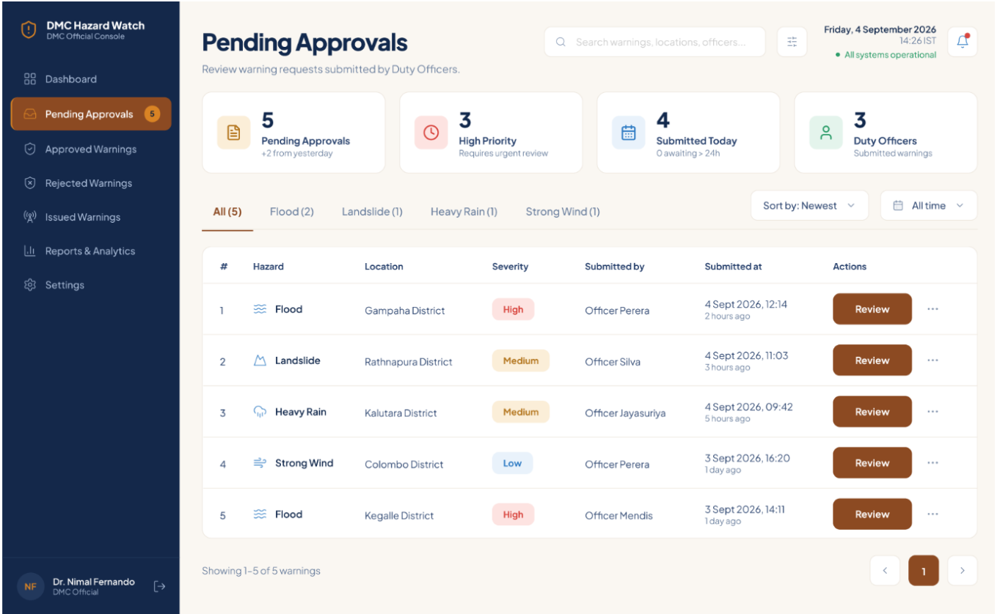

**Review Warning** (Reject and Approve & Issue at the top right, a warning card on the left, the map and
supporting information on the right):

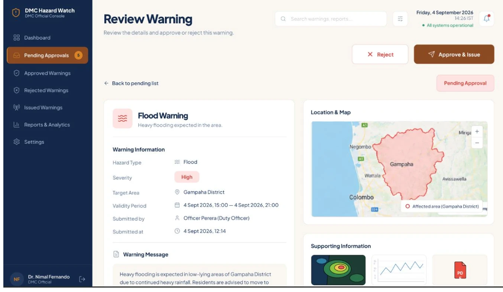

What the design shows, in short:

- **Sidebar:** shield logo, "DMC Hazard Watch / DMC Official Console", seven entries with icons
  (Dashboard, Pending Approvals with an orange count, Approved, Rejected, Issued, Reports & Analytics,
  Settings), and at the bottom a round initials badge, the name, the role and a log-out icon.
- **Top bar:** big title and one line of help, a search box, a filter button, the date and time, a green
  "All systems operational" and a bell.
- **Pending Approvals:** four cards (5 Pending Approvals, 3 High Priority, 4 Submitted Today, 3 Duty
  Officers), tabs (All, Flood, Landslide, Heavy Rain, Strong Wind), "Sort by: Newest" and "All time"
  drop-downs, a table (#, Hazard with an icon, Location, Severity as a soft pill, Submitted by, Submitted
  at with "2 hours ago", a brown Review button and a "…" menu) and a footer "Showing 1–5 of 5 warnings"
  with a pager.
- **Review Warning:** Reject and Approve & Issue, "← Back to pending list" and a pink "Pending Approval"
  pill, a card with the hazard tile and "Warning Information" rows (each with an icon), a cream "Warning
  Message" box, "Location & Map" with the area in red, and "Supporting Information" thumbnails.

## 3. What we built

**Pending Approvals** (seeded demo data, signed in as a DMC Officer):

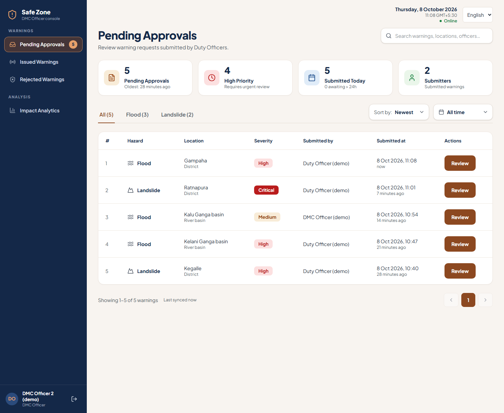

**Review Warning:**

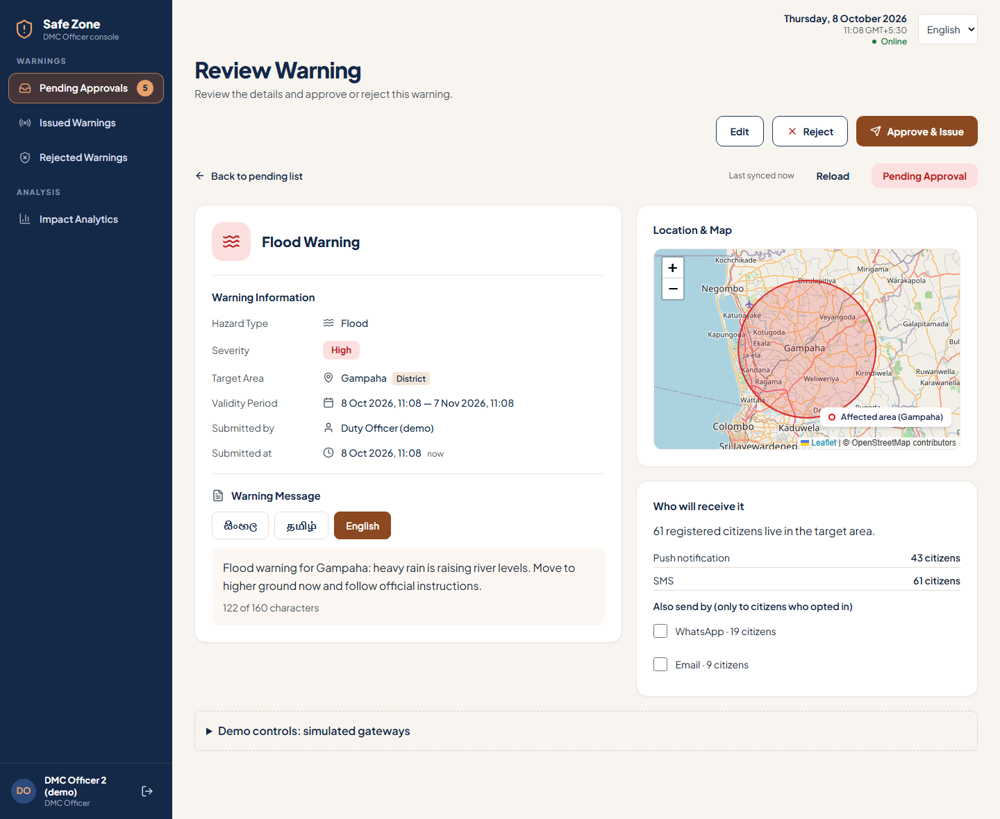

The two sister lists that the sidebar entries open (they did not exist before):

| Issued Warnings                                          | Rejected Warnings                                            |
| -------------------------------------------------------- | ------------------------------------------------------------ |
| 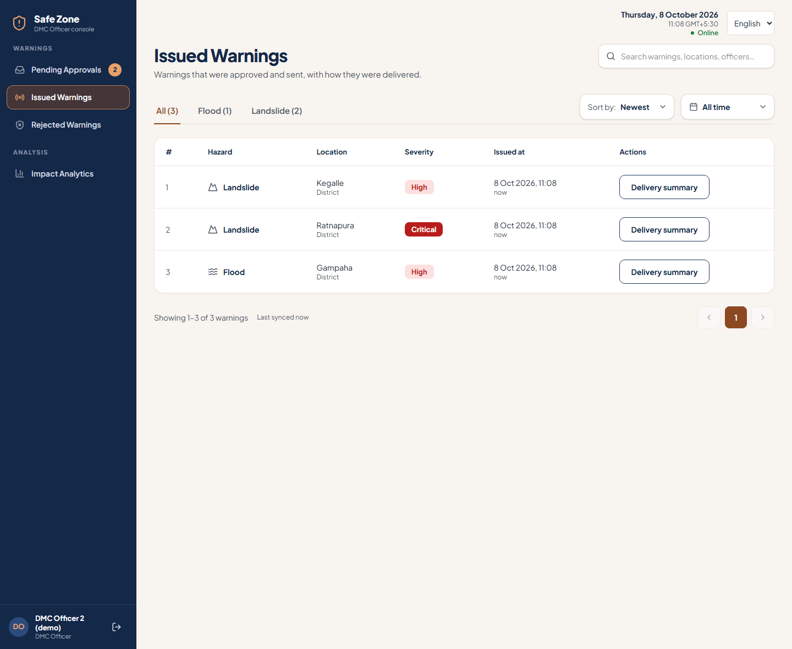 | 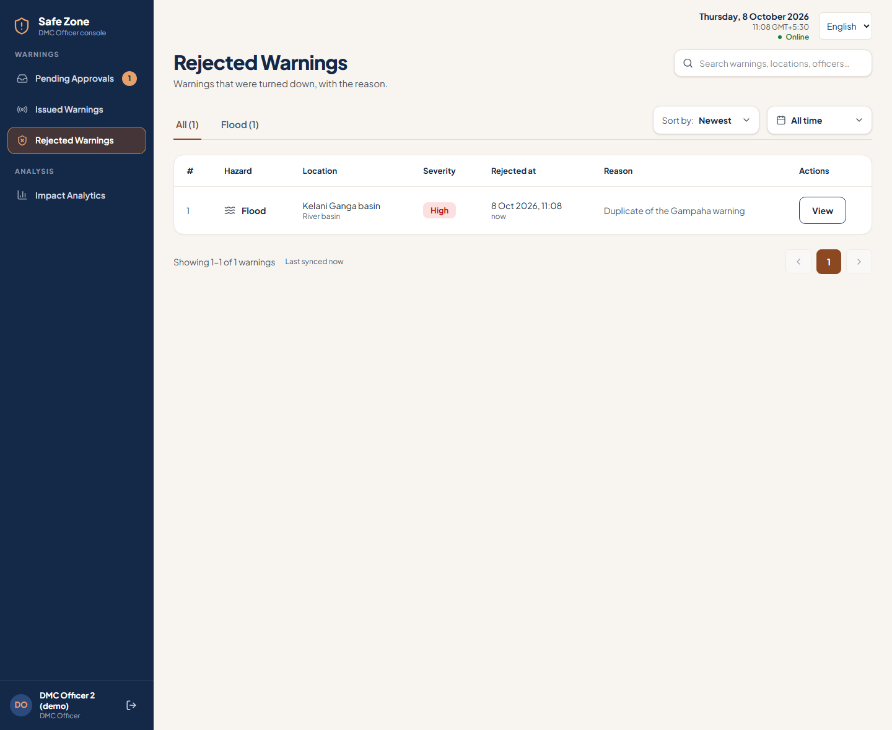 |

The delivery summary (step 14) was moved to the same look, so the whole use case reads as one product:

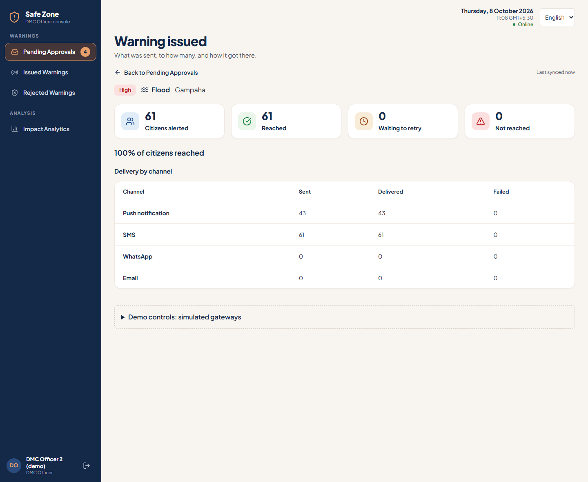

On a phone the sidebar becomes a menu, and the layout holds in Tamil, the language with the longest words:

| Phone: the list                                                  | Phone: the menu                                     | Tamil (draft translation)                                      |
| ---------------------------------------------------------------- | --------------------------------------------------- | -------------------------------------------------------------- |
| 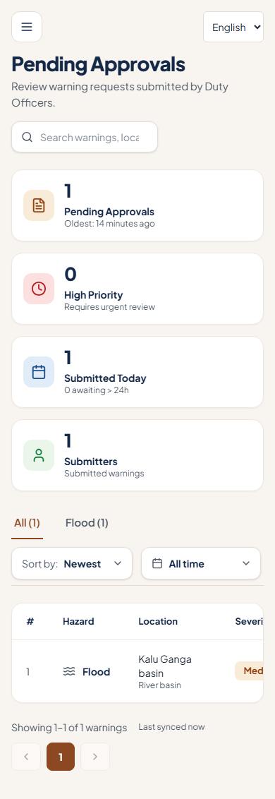 | 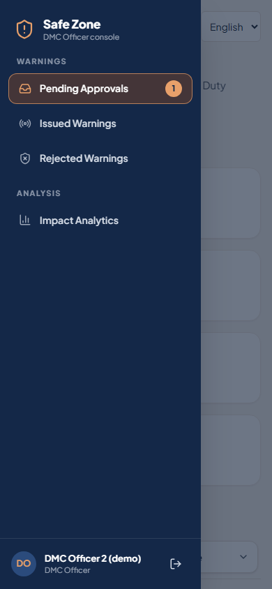 | 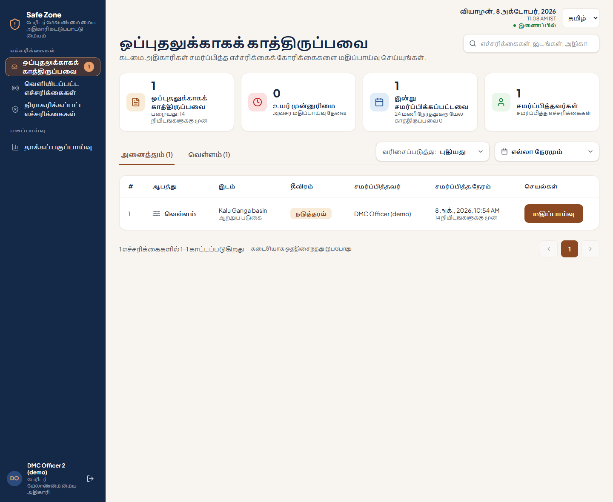 |

## 4. Why the old screens were redesigned

This is what the screens looked like before (the same demo data):

| Before: Pending Approvals                                     | Before: Review Warning                                  |
| ------------------------------------------------------------- | ------------------------------------------------------- |
| 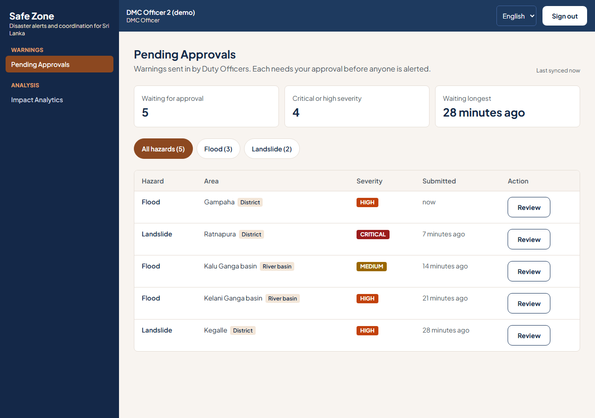 | 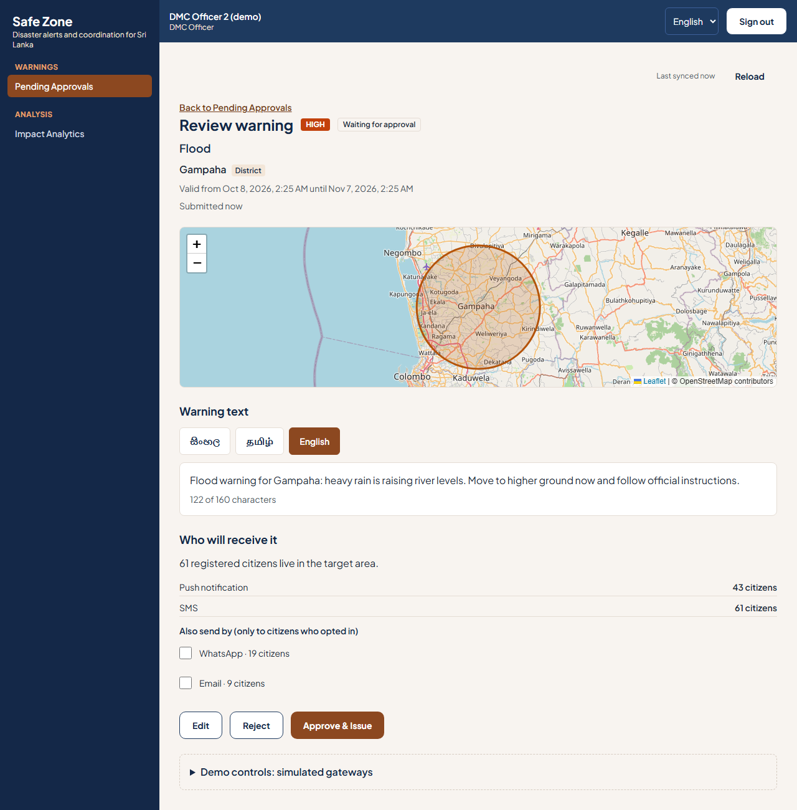 |

The old screens worked and were fully tested, but they had real problems, beyond taste:

1. **Two competing frames.** A coloured band across the top carried the name, role, language and a
   "Sign out" button, and a second dark column carried the navigation. The person and the way out were far
   from the navigation, and the band spent a full row of height on every screen.
2. **Navigation that did not help.** Text-only links, no icons, no count. An officer could not see from the
   sidebar that five warnings were waiting. The only "where am I" cue was a heavy filled block.
3. **A list that stopped at the first screen.** Three plain number boxes, round filter buttons, a table with
   no row numbers, no date (only "7 minutes ago"), no way to search, sort, narrow by time or page through
   more than a screenful.
4. **Dead ends.** Once a warning left the pending list, nothing in the app listed issued or rejected
   warnings: the officer could not look back at what they had sent.
5. **Phones.** The sidebar stacked above the page, so on a phone the officer scrolled past the whole menu
   to reach the list.
6. **Inconsistent with the team's chosen look.** The owner supplied a visual language for the console; the
   old screens did not follow it, and the other use cases will reuse the shell, so fixing it once here
   fixes it for everyone.

The redesign answers each: one sidebar that carries identity, navigation and the count; a list with search,
tabs, sort, period and pages; real Issued and Rejected lists; a phone menu; and the supplied look.

## 5. The rules we used to decide where to differ

The design is a mock-up, drawn without our data model, our other use cases or our requirements. Wherever we
differ, one of these six rules is the reason. The tables below name the rule.

| Rule | Meaning                                                                                                                                                   |
| ---- | --------------------------------------------------------------------------------------------------------------------------------------------------------- |
| R1   | **Truthful.** Show only what the system knows. This system tells people to evacuate; it must never show invented numbers, trends or statuses.             |
| R2   | **Every control works.** No link, button, menu or icon that does nothing, and no screen we have not built.                                                |
| R3   | **Shared contracts are frozen.** The hazard list, roles and API shapes are used by UC-2, UC-3 and UC-4 as well. One owner does not change them alone.     |
| R4   | **The use case wins.** Requirements in the report and plan (edit before approving, three languages, audience before approval, offline) outrank a picture. |
| R5   | **One shell for nine roles.** The sidebar is not only for the DMC Officer; citizens, NGO managers, donors and others use the same frame.                  |
| R6   | **Accessible and phone-ready.** Never colour alone, a name for every icon button, keyboard use, a layout that fits a phone.                               |

## 6. Every change from the given design

### 6.1 Sidebar (every role)

| #   | Given design                                                                | What we built                                                                                                                                                                                                          | Why                                                                                                                                                                                                                                                                                                                                                           |
| --- | --------------------------------------------------------------------------- | ---------------------------------------------------------------------------------------------------------------------------------------------------------------------------------------------------------------------- | ------------------------------------------------------------------------------------------------------------------------------------------------------------------------------------------------------------------------------------------------------------------------------------------------------------------------------------------------------------- |
| S1  | "DMC Hazard Watch" and "DMC Official Console"                               | "Safe Zone" and "{Role} console", for example "DMC Officer console" or "NGO Manager console"                                                                                                                           | **R5.** The report, landing page, browser tab and installable app all say Safe Zone, and the same sidebar is shown to nine roles. A DMC-only name would be wrong for a citizen. The second line keeps the "console" idea and follows the role.                                                                                                                |
| S2  | Orange outlined shield with "!"                                             | A shield with an alert mark in the accent colour, drawn from our own icon set                                                                                                                                          | Same idea and colour. No image file to licence or to load offline.                                                                                                                                                                                                                                                                                            |
| S3  | Dashboard, Pending Approvals, Approved, Rejected, Issued, Reports, Settings | A DMC Officer sees **Pending Approvals, Issued Warnings, Rejected Warnings, Impact Analytics**. Other roles see their own screens.                                                                                     | **R2.** No use case defines a Dashboard or a Settings screen, so those would be dead links. There is no "Approved" state: Approve & Issue is one action (BR3, BR5), so a warning is waiting, issued or rejected. "Reports & Analytics" is UC-4's screen and keeps its own name. Issued and Rejected are new real pages, so those entries of the design exist. |
| S4  | One flat list                                                               | Three small section headings: Warnings, Coordination, Analysis (shown only when a role has entries in them)                                                                                                            | **HCI-01** in the report fixes this grouping for every role, and with nine roles seeing different subsets it keeps the list easy to scan.                                                                                                                                                                                                                     |
| S5  | Active entry: translucent brown fill, orange outline, orange count "5"      | The same look. The number is **live**: how many warnings are waiting, read from the same list the page shows, refreshed the moment a warning is issued or rejected, hidden at zero. A screen reader hears "5 waiting". | **R1.** A badge not backed by data would mislead. **R6.** The count is spoken as a description so the link keeps the clean name "Pending Approvals".                                                                                                                                                                                                          |
| S6  | (not shown)                                                                 | The highlighted entry is the most specific match. On Issued Warnings only that entry is lit; a warning opened from the pending list keeps Pending Approvals lit.                                                       | "Pending Approvals" (`/warnings`) contains the other addresses; without this rule two entries would look active.                                                                                                                                                                                                                                              |
| S7  | Initials badge, name, role and log-out icon at the bottom                   | The same. Initials are the first letters of the first two words and ignore "(demo)". A long name wraps instead of being cut off. Log-out is an icon button named "Sign out" with a tooltip.                            | **R6.** An icon-only button needs a name for screen readers. Signing out with changes still waiting to sync asks first (**BR6**), as before.                                                                                                                                                                                                                  |
| S8  | Desktop only                                                                | On a phone the sidebar is a menu: a button opens it over the page; Escape, tapping outside, or choosing a page closes it                                                                                               | **R6.** Field staff use phones. The old sidebar stacked above the page.                                                                                                                                                                                                                                                                                       |

### 6.2 Top bar

| #   | Given design                                                        | What we built                                                                                                                                                                                                                     | Why                                                                                                                                                                                                                                       |
| --- | ------------------------------------------------------------------- | --------------------------------------------------------------------------------------------------------------------------------------------------------------------------------------------------------------------------------- | ----------------------------------------------------------------------------------------------------------------------------------------------------------------------------------------------------------------------------------------- |
| T0  | Date, search box, filter and bell share one row with the page title | A thin bar above the page holds the date and time, the connection and the language switch; the search box sits on the title row, at the right, as part of each list                                                               | **R5.** The bar belongs to the shared frame, so every screen of every module gets the date, the connection and the language switch, whether or not that screen draws its own page header. The search box belongs to the list it searches. |
| T1  | Date and time, green "All systems operational"                      | The date and time (updating, in the user's language) and a **true** connection status: Online or Offline, next to the existing offline banner                                                                                     | **R1.** We have no system-health feed, so "All systems operational" would be an invented claim. Online/Offline is true and matters in a system built to keep working offline (**BR6**).                                                   |
| T2  | Notification bell with a red dot                                    | Left out                                                                                                                                                                                                                          | **R1, R2.** No use case has notifications to show in the app (alerts go out by push, SMS, WhatsApp and email). A dot with nothing behind it misleads.                                                                                     |
| T3  | A global search box and a filter button on every page               | A **working** search box on each list (it finds by hazard, place, sender and, on Rejected, the reason), plus working Sort and time-range drop-downs and hazard tabs. None on the Review screen, where there is nothing to search. | **R2.** Controls sit where they operate. A global search needs an index across every module, which no use case asks for.                                                                                                                  |
| T4  | (no language control)                                               | Language switcher (English, Sinhala, Tamil) stays in the bar                                                                                                                                                                      | **HCI-06a.** Officers and citizens work in three languages. It was in the old bar and must not be lost.                                                                                                                                   |

### 6.3 Pending Approvals

| #   | Given design                                                                      | What we built                                                                                                                                             | Why                                                                                                                                                                                                                  |
| --- | --------------------------------------------------------------------------------- | --------------------------------------------------------------------------------------------------------------------------------------------------------- | -------------------------------------------------------------------------------------------------------------------------------------------------------------------------------------------------------------------- |
| P1  | Title "Pending Approvals", "Review warning requests submitted by Duty Officers."  | The same words                                                                                                                                            | (kept)                                                                                                                                                                                                               |
| P2  | Card 1 note "+2 from yesterday"                                                   | "Oldest: 2 hours ago": how long the longest-waiting warning has waited                                                                                    | **R1.** A trend needs yesterday's count, which we do not keep. The oldest wait is real, and it is what tells an officer how urgent the queue is.                                                                     |
| P3  | Card 4 "Duty Officers, Submitted warnings"                                        | "Submitters, Submitted warnings": the number of different people who submitted the waiting warnings                                                       | **R1.** DMC Officers can submit too (the Kalu Ganga basin warning in the demo data), so counting them as Duty Officers would be wrong.                                                                               |
| P4  | Cards 2 and 3                                                                     | The same: High Priority counts High and Critical ("Requires urgent review"); Submitted Today counts today's, with how many have waited more than 24 hours | (kept, with the definitions made exact)                                                                                                                                                                              |
| P5  | Tabs: All, Flood, Landslide, **Heavy Rain, Strong Wind**                          | Tabs for the hazards that have warnings, from the system's own list: Flood, Landslide, Cyclone, Tsunami, Drought, Lightning, each with its count          | **R3.** Heavy Rain and Strong Wind are not hazard types in the shared contract that UC-2, UC-3 and UC-4 also use. Adding them changes every module and every translation, so it needs all four owners (open item 1). |
| P6  | "Sort by: Newest" and "All time"                                                  | The same two drop-downs, both working: Newest, Oldest, Severity; All time, Today, Last 24 hours, Last 7 days                                              | (kept)                                                                                                                                                                                                               |
| P7  | Columns #, Hazard (icon), Location, Severity, Submitted by, Submitted at, Actions | The same columns and icons                                                                                                                                | (kept)                                                                                                                                                                                                               |
| P8  | Location "Gampaha District"                                                       | "Gampaha" with "District" under it; a river basin shows "River basin"                                                                                     | A warning can target a river basin as well as a district, and which one it is matters to the officer.                                                                                                                |
| P9  | Submitted by "Officer Perera"                                                     | The name saved with the warning; "Duty Officer" for a draft confirmed from a UC-3 cluster; otherwise the id                                               | **R1.** We never invent a name. The backend now saves the submitter's display name when a warning is submitted (new optional field `submittedByName`, filled in for the demo data by `npm run seed`).                |
| P10 | Severity pills High, Medium, Low                                                  | The same soft pills, plus **Critical as a solid red pill**. Always in words.                                                                              | The design has three levels; the system has four. Solid red keeps Critical from being mistaken for High (**R6**: never colour alone).                                                                                |
| P11 | A brown Review button and a "…" menu on each row                                  | The Review button the same. No "…" menu.                                                                                                                  | **R2.** There are no secondary row actions: Edit, Reject and Approve & Issue live on the review screen. An empty menu is a dead control.                                                                             |
| P12 | "Showing 1–5 of 5 warnings" and a pager                                           | The same, ten rows per page, plus "Last synced …" beside it                                                                                               | **BR6.** When the app is offline the list is a saved copy; the officer must see how old it is.                                                                                                                       |

### 6.4 Review Warning

| #   | Given design                                                                  | What we built                                                                                                                                                                                               | Why                                                                                                                                                                                                                        |
| --- | ----------------------------------------------------------------------------- | ----------------------------------------------------------------------------------------------------------------------------------------------------------------------------------------------------------- | -------------------------------------------------------------------------------------------------------------------------------------------------------------------------------------------------------------------------- |
| V1  | Reject (outline, red ×) and Approve & Issue (brown, send icon), top right     | The same two, in the same place, **plus an Edit button** before them                                                                                                                                        | **R4, flow A2.** An officer may correct the severity, the validity or the text before approving. The design has no way to do that.                                                                                         |
| V2  | "← Back to pending list" and a pink "Pending Approval" pill                   | The same. The pill follows the status (Pending Approval, Issued, Rejected). "Last synced" and a Reload button sit beside it.                                                                                | **BR6** and teamwork: Reload picks up what another officer changed; the sync time says how old an offline copy is.                                                                                                         |
| V3  | "Flood Warning" with a subtitle "Heavy flooding expected in the area."        | "Flood Warning" with the hazard tile (tinted by severity), no subtitle                                                                                                                                      | **R1.** A warning has no summary field; its words are in the message below. We would have had to invent the subtitle.                                                                                                      |
| V4  | "Warning Information": six rows with icons                                    | The same six rows, labels and icons. Validity reads "7 Oct 2026, 15:00 — 8 Oct 2026, 15:00"; "Submitted at" shows the date and "3 hours ago". Each end of the range stays in one piece when the line wraps. | (kept)                                                                                                                                                                                                                     |
| V5  | "Warning Message": one cream box, one text                                    | The same cream panel, with **three tabs** (English, සිංහල, தமிழ்), the count "x of 160 characters" and a mark on a language that is still empty                                                             | **R4: SC1-05, HCI-06a.** A warning goes out in three languages and one SMS holds 160 characters. The officer must be able to read each text and see the limit before approving.                                            |
| V6  | "Location & Map": the district drawn as a red outline, a legend, zoom buttons | The same card, legend and zoom. A **river basin** is drawn as its real outline; a **district** as a circle around its centre.                                                                               | **R1.** We hold no district boundary data, so a circle is honest about being approximate. Outlines can be added when a data set exists (open item 2).                                                                      |
| V7  | "Supporting Information": heat map, chart, PDF thumbnails                     | "Who will receive it": how many registered citizens live in the area, how many each channel reaches (push, SMS, optional WhatsApp and email), and how many cannot be reached                                | **R1, R4: SD1-03.** Warnings carry no attachments in the data model, and thumbnails with nothing behind them would be fake. The audience estimate is a requirement: the officer sees who will be alerted before approving. |
| V8  | (not shown)                                                                   | A "Fix these before issuing" list, notes when approval was started but not finished (**SD1-05**), the offline note on Approve & Issue (**BR6**), and the demo-only simulated gateways panel                 | Behaviour the use case needs. The gateway panel exists only in the demo and is hidden in production.                                                                                                                       |

### 6.5 Look, language and states

| #   | Given design                                                            | What we built                                                                                                                     | Why                                                                                                                                                     |
| --- | ----------------------------------------------------------------------- | --------------------------------------------------------------------------------------------------------------------------------- | ------------------------------------------------------------------------------------------------------------------------------------------------------- |
| L1  | Navy sidebar, cream page, brown accent, rounded white cards, soft pills | The same, as design tokens shared by the whole app; the Plus Jakarta Sans font the product already uses                           | (kept)                                                                                                                                                  |
| L1b | Dates as "4 Sept 2026, 12:14" and "Friday, 4 September 2026"            | The same style in English (day first, 24-hour clock, "7 Oct 2026, 14:05"); Sinhala and Tamil use their own locale's style         | Day first and a 24-hour clock are how dates are written in Sri Lanka and how the design shows them. A person reading "10/7" should never have to guess. |
| L2  | English only                                                            | English, Sinhala and Tamil are all written. The Sinhala and Tamil texts are drafts.                                               | **HCI-06a.** They still need a native speaker to read them before submission (open item 5).                                                             |
| L3  | Only the full list is drawn                                             | A spinner while loading, a plain sentence when the list is empty, an error with Try again, a saved copy with its age when offline | **BR6** and basic honesty about state: the officer always knows whether they are looking at nothing, at failure or at old data.                         |

## 7. Kept exactly as designed

Navy sidebar with icons and an orange active entry; round initials badge with name, role and log-out at the
bottom; large title with a one-line help text; four summary cards with coloured icon tiles; underline tabs
with counts; the two drop-downs; the numbered table with hazard icons and soft severity pills; the brown
Review button; the "Showing … of …" footer with a pager; Reject, Approve & Issue, the back link and the
status pill on the review screen; the warning card with icon rows; the map card with a red area and a key.

## 8. Added, because the use case needs it

- **Issued Warnings** and **Rejected Warnings** pages (and the sidebar entries for them).
- **Edit** on the review screen (alternate flow A2).
- **Three-language tabs** with the SMS counter (SC1-05, HCI-06a).
- **Who will receive it** (SD1-03).
- **Last synced / Reload** and the offline behaviour (BR6).
- The **phone menu**.
- The **delivery summary** in the same look (it was not in the supplied design).

## 9. Not done: open items for the team

1. **Heavy Rain and Strong Wind** (R3). If the team wants them, the hazard list in
   `backend/src/shared/contracts/enums.ts` gets two entries and every module's translations two lines. UC-2,
   UC-3 and UC-4 owners must agree first.
2. **District outlines.** Needs a boundary data set (for example the Survey Department's). Until then a district is a circle.
3. **Supporting Information** (maps, charts, PDFs). Needs attachments in the data model and file storage.
4. **Dashboard, Settings, notifications, global search.** No use case defines them (R2).
5. **Sinhala and Tamil proofreading.** All new texts are drafts.
6. **Names on old data.** Warnings saved before `submittedByName` existed show the id until their name is set. The demo seed fills it in.

## 10. Where the code changed

Shared files (frozen by the foundation, changed here at the owner's request; mention them in the pull request):

- `frontend/src/shared/layout/AppShell.tsx`, `navigation.ts` (an icon and a live count on a sidebar entry, and
  `activeNavItem`), `ModulePlaceholder.tsx`
- `frontend/src/shared/ui/`: `Icon.tsx` (about 25 new icons) and four new parts, `Card`, `PageHeader`,
  `StatCard`, `SeverityPill`
- `frontend/src/shared/i18n/messages.en.ts`, `messages.si.ts`, `messages.ta.ts` (about 90 new texts)
- `frontend/src/navigation.ts` (the two new entries and icons), `frontend/src/shared/testing/server.ts`
  (default answers for the list and demo gateway calls)

UC-1 files:

- `frontend/src/features/warnings/`: `WarningsListPage.tsx` (replaces `PendingApprovalsPage.tsx`),
  `WarningsTable.tsx`, `ListToolbar.tsx`, `listView.ts`, `HazardIcon.tsx`, `ReviewWarningPage.tsx`,
  `MessageTabs.tsx`, `WarningMap.tsx`, `AudiencePanel.tsx`, `DeliverySummaryPage.tsx`,
  `ConfirmIssueDialog.tsx`, `EditWarningForm.tsx`, `nav.ts`, `api.ts`, `format.ts`, `types.ts`, `index.tsx`
- Backend: one optional field, `submittedByName`, in `Warning.ts`, `models.ts`, `dto.ts` and the demo seed

## 11. How it was checked

| Check                                                                    | Result                                                                                                                      |
| ------------------------------------------------------------------------ | --------------------------------------------------------------------------------------------------------------------------- |
| Frontend component and unit tests (Vitest, Testing Library, MSW)         | 717 tests in 34 files; `features/warnings` at 100% of statements, branches, functions and lines; shared code above its gate |
| Backend (Jest)                                                           | 964 tests in 49 suites; `modules/warnings` still at 100%                                                                    |
| End to end (Playwright: real browser, real API, freshly seeded database) | 41 pass, 1 skipped (the screenshot script, which only runs on request)                                                      |
| ESLint, Prettier, TypeScript                                             | Clean in both workspaces                                                                                                    |
| By eye                                                                   | The screenshots above, at 1440 px and 390 px wide and in Tamil                                                              |

Two defects turned up while testing, and are fixed:

1. **Switching lists crashed the page.** Pending, Issued and Rejected are one component, so choosing another one in
   the sidebar kept the previous list's rows on screen for a moment and failed with `Invalid time value` (a pending
   warning has no issue time). Only the browser test caught it, because unit tests open each screen fresh. Each list
   now starts afresh (it is keyed by its kind), and two regression tests fail if the key is taken out.
2. **The count beside Pending Approvals would have gone stale.** After a warning was issued or rejected it kept
   its old number until the next page load. The issue and reject screens now tell the sidebar to read it again, and
   a test follows the whole path from rejecting to the number dropping.

## 12. See it yourself

```bash
npm run seed
npm run dev
```

Open <http://localhost:5173>, sign in as `dmc.officer2@safezone.lk` with the demo password from the README,
and open **Pending Approvals**. (`npm run seed` is safe to run again; it does not wipe data unless given
`--fresh`.)
